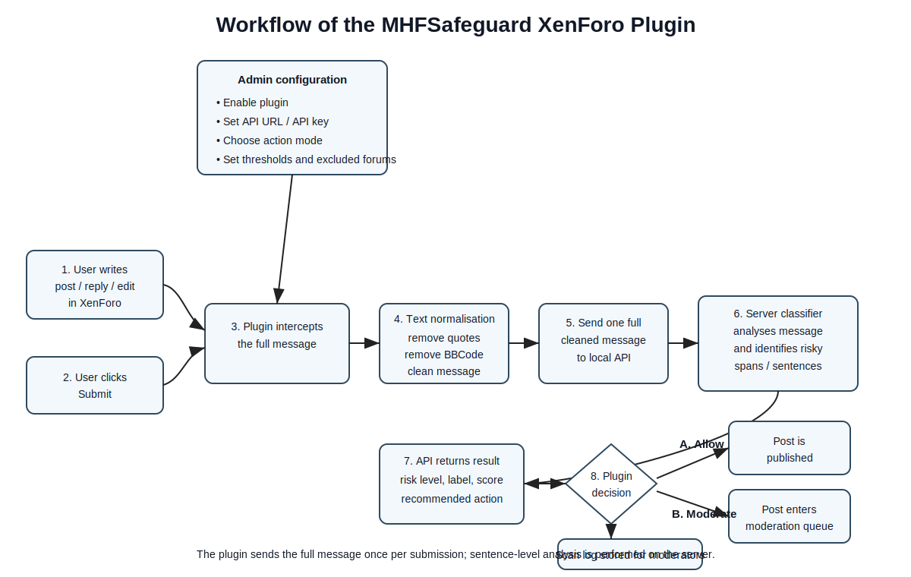
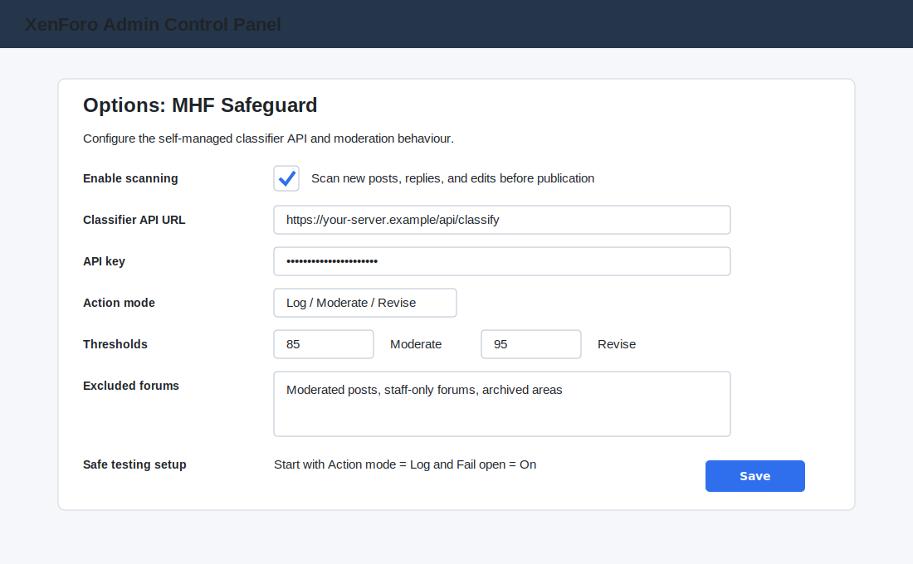
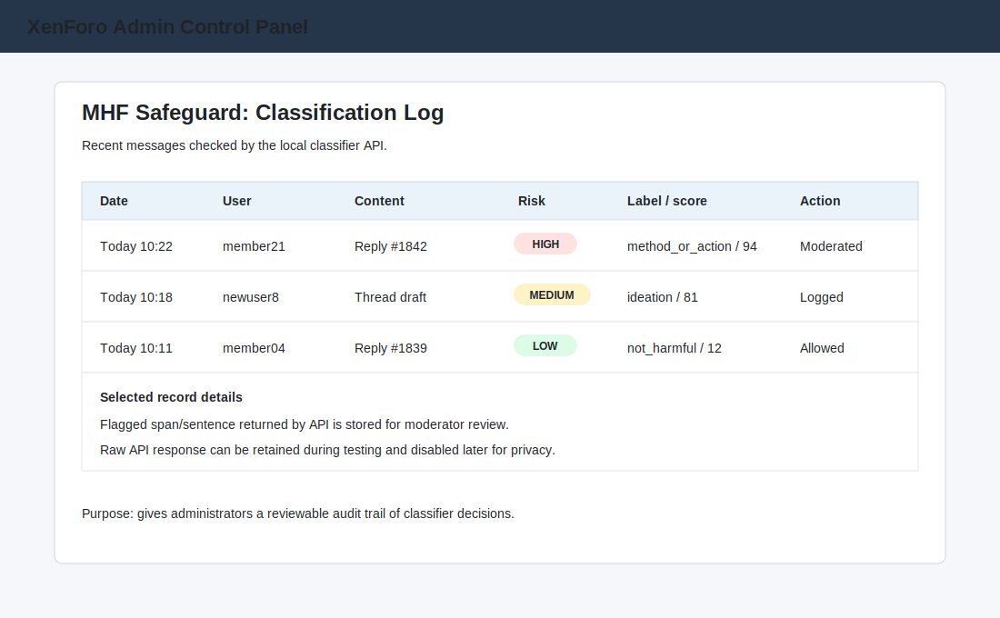
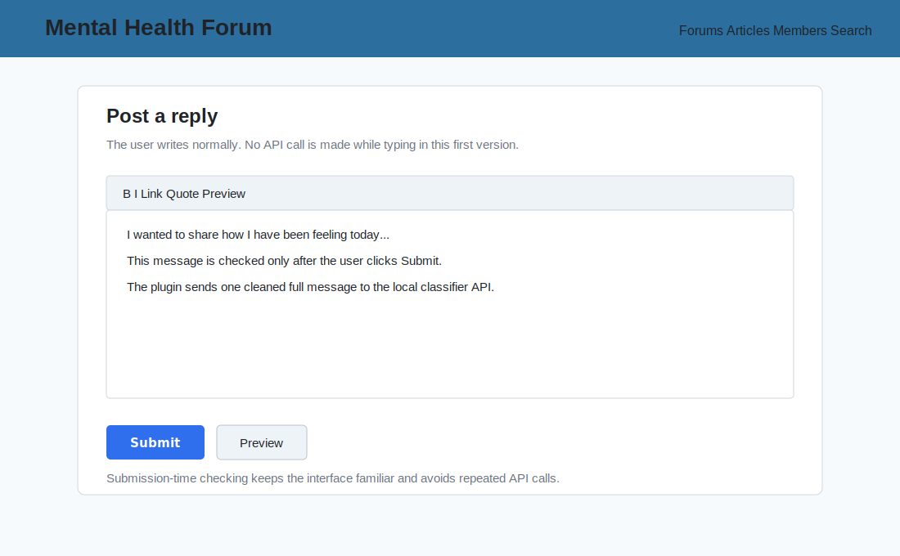
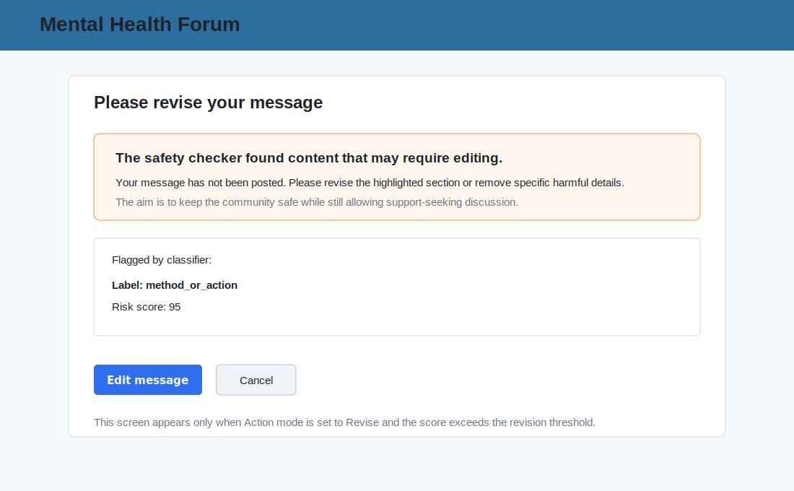
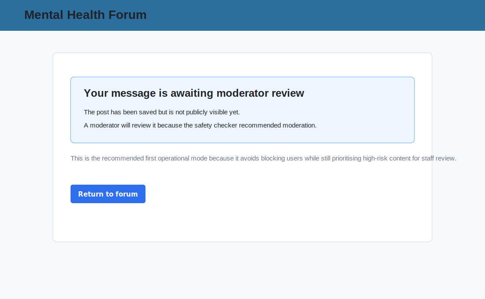

# MHF Safeguard

**MHF Safeguard** is a XenForo add-on concept for sending forum posts, replies, and edited messages to a self-managed classifier API for mental-health community safety moderation.

The plugin is designed for the research project **Safeguarding Online Mental Health Communities**. Its main purpose is to replace third-party moderation APIs with a locally controlled classifier server that can detect high-risk mental-health forum content and support moderators.

## Core idea

The plugin sends **one full cleaned message per submission** to your own classifier API.

It does **not** send each sentence as a separate API call. Sentence-level or span-level analysis should be performed on the server side, and the server should return the risky sentence, phrase, span, label, score, and recommended action.

```text
User writes post/reply/edit
→ user clicks Submit
→ plugin intercepts full message
→ plugin cleans text
→ plugin sends one full message to local classifier API
→ API returns risk level, label, score, and recommended action
→ plugin allows, logs, moderates, or asks the user to revise
```

## Workflow diagram



## How the plugin works

1. A user writes a new thread, reply, or post edit in XenForo.
2. The user clicks **Submit**.
3. The MHFSafeguard plugin intercepts the full message during submission.
4. The text is normalised by removing quoted content, BBCode, and formatting noise.
5. The plugin sends one cleaned full message to the configured classifier API.
6. The classifier server analyses the message and may identify risky sentences or spans internally.
7. The API returns a classification result.
8. The plugin applies the configured action: allow, log, moderate, or revise.
9. A scan log is stored for administrator/moderator review.

## Configuration required before use

In the XenForo Admin Control Panel, configure the MHF Safeguard options.

| Setting | Purpose | Recommended first value |
|---|---|---|
| Enable scanning | Turns the plugin on/off | Enabled only on a test forum first |
| Classifier API URL | Endpoint for your classifier server | `https://your-server.example/api/classify` |
| API key | Secret token sent to your API | Use a private key/token |
| Action mode | Determines what happens after classification | `log` first, then `moderate` |
| Moderation threshold | Score at which post is sent to moderation | `85` |
| Revision threshold | Score at which user is asked to revise | `95` |
| API timeout | Maximum time to wait for server response | `8–10 seconds` |
| Fail open | Allows posting if API is unavailable | On during testing |
| Store raw API response | Saves full API response for debugging | On during testing, off later if needed |
| Store cleaned message | Saves cleaned text in logs | Off by default for privacy |
| Excluded forums | Forums that should not be scanned | Staff-only, archived, already moderated forums |

## Recommended testing sequence

Start safely with logging only:

```text
Enable scanning = On
Action mode = Log
Fail open = On
Store raw API response = On
Store cleaned message text = Off
```

After checking that API responses are correct, change to:

```text
Action mode = Moderate
```

Only after further testing, consider:

```text
Action mode = Revise
```

## Expected API request

The plugin should send a payload similar to this:

```json
{
  "platform": "xenforo",
  "source": "mhf_safeguard_plugin",
  "site_url": "https://www.mentalhealthforum.net",
  "context": {
    "content_type": "post",
    "content_id": 12345,
    "thread_id": 456,
    "node_id": 12,
    "user_id": 99,
    "username": "example_user",
    "title": "Thread title",
    "is_first_post": false
  },
  "message": "Cleaned full message text goes here.",
  "message_hash": "sha256_hash_here",
  "return_spans": true,
  "return_sentences": true,
  "sent_at": 1710000000
}
```

## Expected API response

The classifier server should return a result similar to this:

```json
{
  "risk_level": "high",
  "recommended_action": "moderate",
  "highest_label": "method_or_action",
  "highest_score": 94,
  "flagged_parts": [
    {
      "text": "flagged sentence or phrase",
      "label": "method_or_action",
      "score": 94,
      "start_offset": 20,
      "end_offset": 60
    }
  ]
}
```

The score can be returned as either `0.94` or `94`; the plugin should normalise scores to a 0–100 scale.

## Possible plugin actions

| Action | Behaviour |
|---|---|
| Allow | The post is published normally |
| Log | The result is stored but the post is allowed |
| Moderate | The post is placed into the XenForo moderation queue |
| Revise | The user is asked to edit the message before it is submitted |

## Mock screens

The following mock screens show the intended user and administrator experience.

### 1. Admin configuration screen



This screen allows the forum administrator to enable the plugin, set the classifier API URL, enter an API key, choose the action mode, set thresholds, and exclude forums from scanning.

### 2. Admin classification log



This screen shows a reviewable log of classifier decisions. It helps moderators and administrators inspect recent scans, risk levels, labels, scores, and actions taken.

### 3. User post editor



The user writes normally in the standard XenForo editor. In the first version, the plugin does not call the API while the user is typing. The API call occurs only after the user clicks **Submit**.

### 4. User revision warning



If the classifier returns a very high score and the plugin is set to **Revise** mode, the message is not posted. The user is asked to edit the message before trying again.

### 5. User moderation queue notice



If the plugin is set to **Moderate** mode and the classification score exceeds the moderation threshold, the post is saved but not publicly visible until reviewed by a moderator.

## Difference from Perspective API style moderation

| Aspect | Perspective API style | MHFSafeguard |
|---|---|---|
| API target | Google Perspective API | Self-managed classifier server |
| Main task | Toxicity scoring | Mental-health safety classification |
| Message sent | Full message | Full cleaned message |
| Sentence-by-sentence requests | No | No |
| Sentence/span analysis | Returned by external API | Performed by your server |
| Labels | Toxicity, insult, threat, etc. | `method_or_action`, `ideation`, `not_harmful`, etc. |
| Data control | External third-party API | Locally controlled / self-managed API |
| Main action | Allow, warn, moderate | Allow, log, moderate, revise |

## Repository structure

The intended XenForo add-on path is:

```text
src/addons/Pankaj/MHFSafeguard/
```

Planned structure:

```text
src/addons/Pankaj/MHFSafeguard/
├── addon.json
├── Setup.php
├── Content/
├── Pipeline/
├── Gateway/
├── Repository/
├── XF/
│   └── Service/
│       ├── Thread/
│       └── Post/
└── _data/
```

## Installation notes

For a XenForo development or test installation:

1. Copy the add-on folder to:

```text
src/addons/Pankaj/MHFSafeguard/
```

2. In XenForo Admin CP, install the add-on.
3. Configure the plugin options.
4. Start with **Action mode = Log**.
5. Submit test posts and verify the classification log.
6. Move to **Moderate** mode only after confirming that API results are reliable.

## Privacy-oriented design

The plugin is designed around a self-managed classifier API. This gives forum administrators more control over where sensitive forum content is processed, how long responses are retained, and how moderation decisions are audited.

For operational use, avoid storing full message text unless it is needed for debugging or authorised moderator review.
